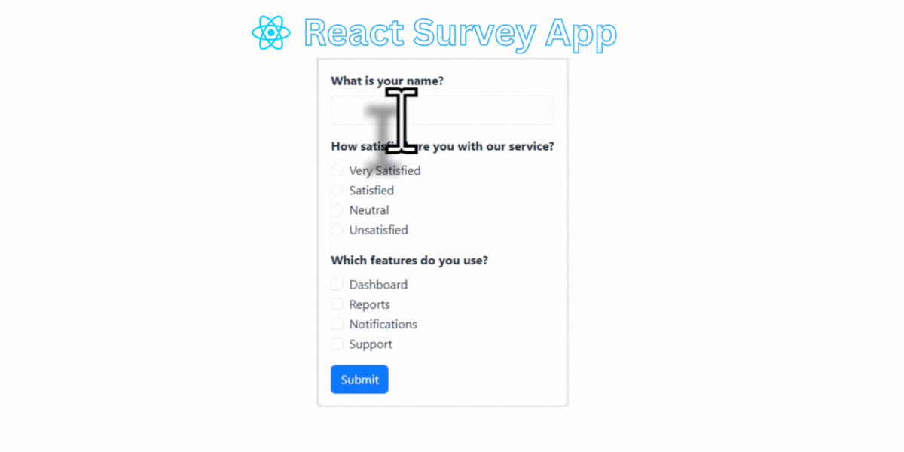

# 📝 Survey Website (ReactJS + Bootstrap)

## 📖 Project Overview  
**Survey Website** is a simple and interactive React-based web application that allows users to answer survey questions and submit their responses.  
It is designed with **Bootstrap** for a clean, responsive layout and focuses on **React state management** for handling user input dynamically.

---

## 🚀 Features

- 📋 Dynamic Survey Form — handles multiple types of questions  
- 💡 Real-time State Updates using React Hooks (`useState`)  
- 🎨 Responsive UI built with **Bootstrap 5**  
- 🔁 Parent–Child communication via **props**  
- ✅ Form submission with validation  
- 📊 Console-based data handling (can be extended to APIs or databases)  

---

## 🏗️ Tech Stack

| Technology | Purpose |
|-------------|----------|
| **ReactJS** | Frontend Framework |
| **Bootstrap 5** | UI Design and Layout |
| **JavaScript (ES6+)** | Core Programming Language |
| **Vite / Create React App** | Development Environment |
| **Git & GitHub** | Version Control |

---

## 📂 Project Structure

